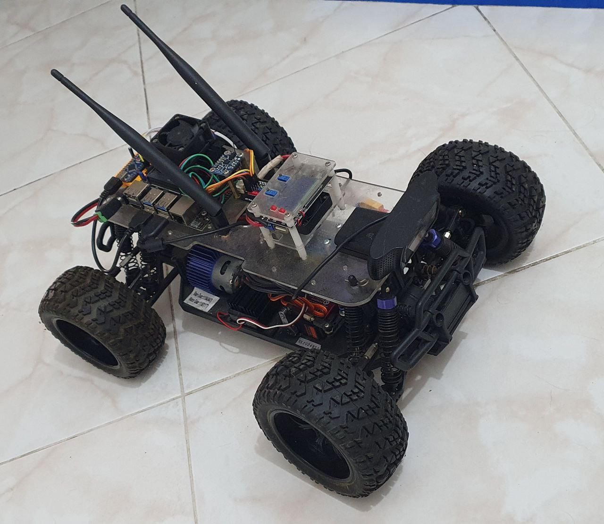
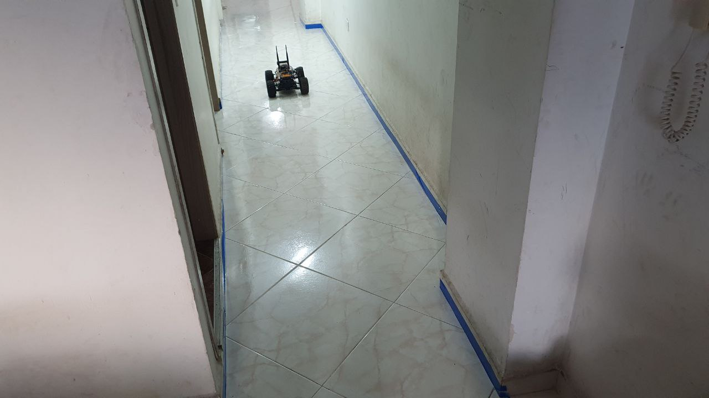

# UNAL_ComputerVision2021

## About this project.
The notebook called [Main](./Main.ipynb) is the file that shows the initial sequence of computer vision operation to get the desired behavior, to detect lines on a hallway selected (my current apartment where I am living). Then, the image processing pipeline is created on [lane_detection_pipeline.py](./lane_detection_pipeline.py) as a class that receives the image and persist values to obtain better performance with each operation with the class called `LaneDetection`. The pipeline is "unit tested" with the notebook [TestComputerVisionPipeline](./TestComputerVisionPipeline.ipynb) where you can also see some interesting results over the image data set available on [dataSet3](./dataSet3) folder.

## Car used to capture images ##

## Environment selected ##

