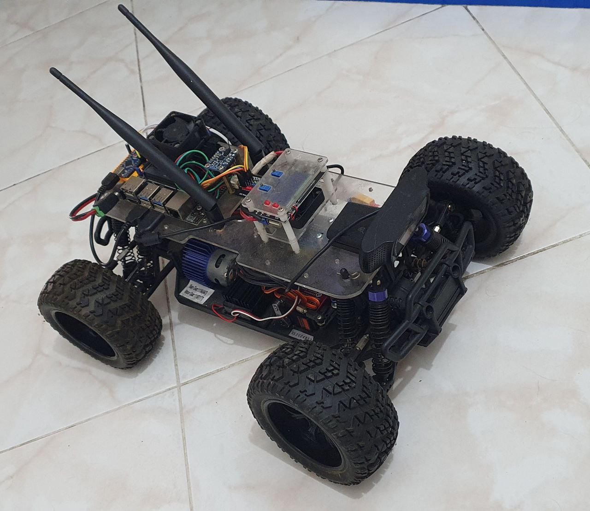
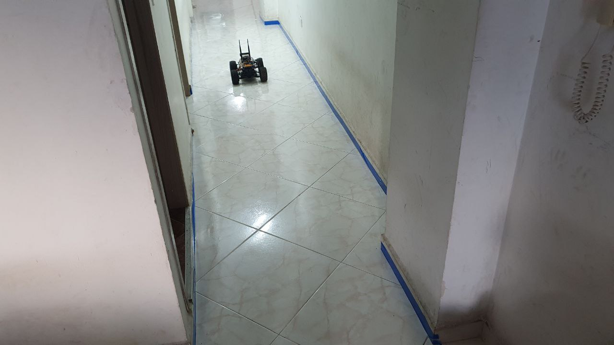

# Computer Vision Project 2021 
Universidad Nacional de Colombia Sede Medellín

## About this project.
The notebook called [Main](./ComputerVisionProject/Main.ipynb) is the file that shows the initial sequence of computer vision operation to get the desired behavior, to detect lines on a hallway selected (the current apartment where I am living). Then, the image processing pipeline is created on [lane_detection_pipeline.py](./ComputerVisionProject/lane_detection_pipeline.py) as a class that receives the image and persist values to obtain better performance with each operation with the class called `LaneDetection`. The pipeline is "unit tested" with the notebook [TestComputerVisionPipeline](./ComputerVisionProject/TestComputerVisionPipeline.ipynb). Additionally, the [TestDataSetValidation](./ComputerVisionProject/TestDataSetValidation.ipynb) notebook shows the result over the images in the folders [dataSet3](./ComputerVisionProject/dataSet3) and [dataSet4](./ComputerVisionProject/dataSet4).

## How to run and play with the project? ##

This project is wrapped on a Docker container to run a jupyter-lab environment. Make sure that you have docker installed in your machine. Open the OS Terminal and then execute the [`build`](./docker_scripts/build) script once to create the container and [`run`](./docker_scripts/run) always:

```
$ # build to create the container (just need to be executed only once)
$ ./docker_scripts/build
$ # run to execute the jupyter-lab container
$ ./docker_scripts/run
```

Once the docker container is running, open your web browser and go to http://localhost:8899. The password required is `unal2021`.

## Car used to capture images ##


## Environment selected ##

